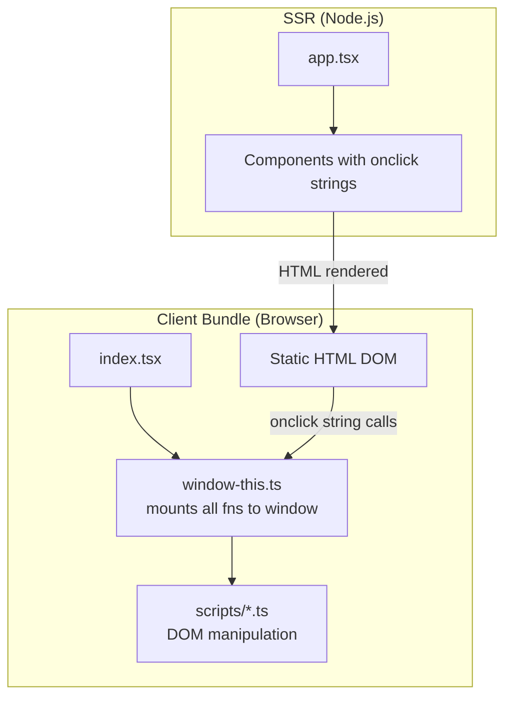
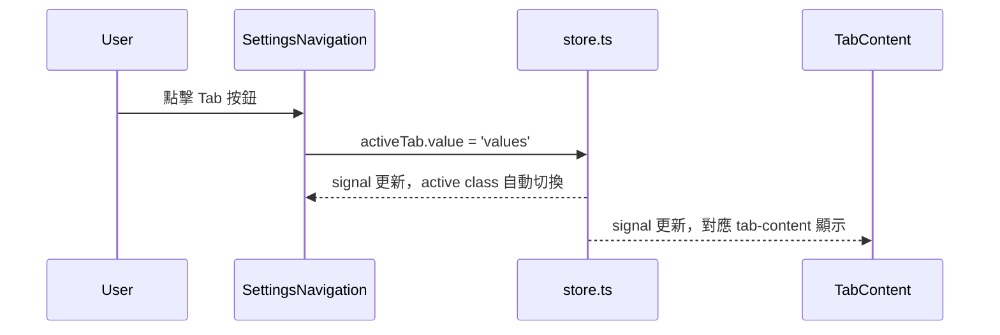
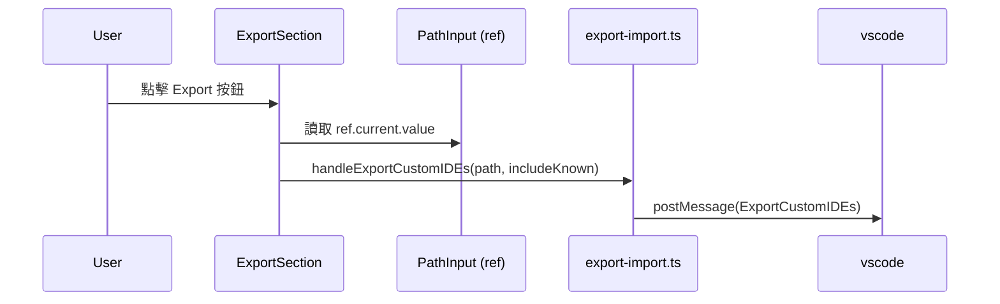
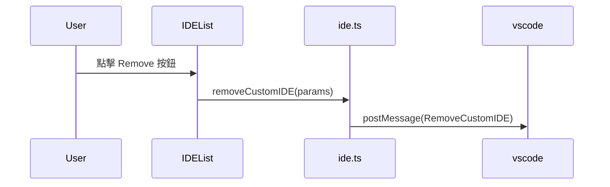

# Design Document: webview-preact-refactor

## Overview

本次重構將 `webview/src/` 中所有殘留的 HTML 字串事件屬性（`onclick="..."` / `onchange="..."` / `onkeyup="..."`）與直接 DOM 操作，全面遷移至 Preact JSX 事件處理（`onClick={handler}`）與 `@preact/signals` 狀態管理。

重構範圍涵蓋：Tab 導覽列、Sync/AllSettings/Selected 三個分頁的操作按鈕、IDE 列表的互動按鈕、語言設定下拉選單、Export/Import 面板的所有輸入與按鈕。完成後 `window-this.ts` 可大幅精簡，`scripts/` 中的 DOM 操作函數可逐步移除或轉為純邏輯函數。

**重要限制**：`app.tsx`（SSR 根組件）不在本次修改範圍內。SSR 在 Node.js 環境執行，不需要事件處理，維持現狀即可。

---

## Architecture

### 現況架構（Before）



### 目標架構（After）

```mermaid
graph TD
    subgraph SSR["SSR (Node.js) — 不修改"]
        APP[app.tsx] --> COMP_SSR[Components — SSR only renders structure]
    end

    subgraph CLIENT["Client Bundle (Browser)"]
        INDEX[index.tsx] --> HYDRATE[hydrate() — Preact takes over]
        HYDRATE --> COMP_CLIENT[Components with onClick JSX handlers]
        COMP_CLIENT --> STORE[store.ts — @preact/signals]
        COMP_CLIENT --> VSCODE[vscode.postMessage]
        STORE -->|signal changes| COMP_CLIENT
        WINDOW_MIN[window-this.ts\n精簡版 — 僅保留必要函數]
    end
```

### 分層說明

| 層次 | 職責 | 修改方向 |
|------|------|----------|
| `app.tsx` | SSR HTML 骨架產生 | **不修改** |
| `components/` | UI 渲染 + 事件處理 | 移除 `onclick` 字串，改用 JSX handler |
| `store.ts` | 全域 signal 狀態 | 新增 `activeTab`、`exportPaths` 等 signals |
| `scripts/` | 業務邏輯 | 移除 DOM 操作，保留純邏輯函數 |
| `window-this.ts` | window 函數掛載 | 大幅精簡，僅保留向後相容項目 |
| `index.tsx` | 初始化 + hydration | 擴展 hydration 範圍至新組件 |

---

## Sequence Diagrams

### Tab 切換流程（After）



### Export/Import 操作流程（After）



### IDE 操作流程（After）



---

## Components and Interfaces

### 1. SettingsNavigation（重構）

**Purpose**: Tab 導覽列，切換四個分頁

**現況問題**: 使用 `onclick="switchTab('sync')"` 字串屬性

**重構後介面**:
```typescript
// store.ts 新增
export const activeTab = signal<'sync' | 'values' | 'selected' | 'export-import'>('sync');

// SettingsNavigation.tsx
export function SettingsNavigation(): JSX.Element
// 使用 onClick={() => activeTab.value = 'sync'} 等 JSX handler
// 使用 activeTab.value 決定哪個 tab 有 active class
```

**Responsibilities**:
- 渲染四個 Tab 按鈕
- 讀取 `activeTab` signal 決定 active 狀態
- 點擊時更新 `activeTab` signal

### 2. Tab 內容組件（SyncTab / AllSettingsTab / SelectedTab）

**Purpose**: 各分頁的容器，根據 `activeTab` signal 顯示/隱藏

**現況問題**: 使用 `onclick` 字串屬性呼叫 `syncSettings()`、`refreshSettings()` 等

**重構後介面**:
```typescript
// SyncTab.tsx — 所有按鈕改用 JSX handler
export function SyncTab(): JSX.Element
// onClick={() => syncSettings()}
// onClick={() => clearSearch()}
// onInput={(e) => { searchQuery.value = e.currentTarget.value; saveSearchHistory(); }}
```

**Responsibilities**:
- 讀取 `activeTab` signal 決定是否顯示（`display: none` 或 conditional render）
- 按鈕直接呼叫 import 進來的函數，不透過 `window`

### 3. IDEList / IDEListSection（重構）

**Purpose**: 渲染 IDE 列表，含移除、開啟資料夾、開啟 settings.json 等操作

**現況問題**: `BtnRemoveCustomIDE`、`BtnOpenIDEFolder`、`BtnOpenSettingsJson` 使用 `onclick` 字串

**重構後介面**:
```typescript
// IDEList.tsx
function BtnRemoveCustomIDE(props: { ide: {...}; index: number }): JSX.Element
// onClick={() => removeCustomIDE(params)}

function BtnOpenIDEFolder(props: { path: string }): JSX.Element
// onClick={() => openIDEFolder(props.path)}

function BtnOpenSettingsJson(props: { idePath: string; ideName: string }): JSX.Element
// onClick={() => openSettingsJson(props.idePath, props.ideName)}

// IDEListSection 的 Add / Refresh 按鈕
// onClick={() => addCustomIDE()}
// onClick={() => refreshIDEs()}
```

### 4. LanguageConfiguration（重構）

**Purpose**: 語言設定下拉選單

**現況問題**: `onchange="changePrimaryLanguage()"` 字串屬性

**重構後介面**:
```typescript
export function LanguageConfiguration(props: ILanguageConfigProps): JSX.Element
// onChange={(e) => changePrimaryLanguage(e.currentTarget.value)}
// onClick={() => openLanguageConfig()}
```

**注意**: `changePrimaryLanguage()` 需重構為接受 `value` 參數，不再從 DOM 讀取 `#primaryLang`

### 5. ExportImportPanel 及子組件（重構）

**Purpose**: 匯出/匯入設定面板

**現況問題**: `actionOnClick` 字串 prop、`PathInput` 的 `onBrowse` 字串

**重構後介面**:
```typescript
// ActionButton.tsx — onClick 改為函數型別
interface IActionBtnProps {
  onClick: () => void  // 從 string 改為 () => void
  // ...
}

// PathInput.tsx — 使用 useRef 管理 input 值
interface IPathInputProps {
  id: string
  placeholder: string
  onBrowse: () => void  // 從 string 改為 () => void
  inputRef?: Ref<HTMLInputElement>  // 新增 ref prop
}

// ExportSection.tsx — 傳入函數而非字串
interface IExportSectionProps {
  onAction: () => void  // 從 actionOnClick: string 改為函數
  onBrowse: () => void  // 新增
  // ...
}

// ExportImportPanel.tsx — 使用 useRef 讀取 input 值
export function ExportImportPanel(props: IExportImportPanelProps): JSX.Element
// 建立各 input 的 useRef，傳入子組件
// 按鈕 onClick 讀取 ref.current.value 後呼叫 export-import.ts 函數
```

---

## Data Models

### store.ts 新增 Signals

```typescript
// 新增：當前活躍分頁
export const activeTab = signal<TabName>('sync');
type TabName = 'sync' | 'values' | 'selected' | 'export-import';

// 新增：Export/Import 路徑（由 message handler 更新）
export const exportPath = signal<string>('');
export const importPath = signal<string>('');
```

**Validation Rules**:
- `activeTab` 只接受四個合法值
- `exportPath` / `importPath` 可為空字串（表示使用 file dialog）

### 函數簽名變更

```typescript
// language.ts — 新增 value 參數，不再讀 DOM
export function changePrimaryLanguage(value: string): void

// export-import.ts — 新增路徑參數，不再讀 DOM
export function handleExportCustomIDEs(customPath: string, includeKnownIDEs: boolean): void
export function handleExportSelectedSettings(customPath: string): void
export function handleExportAll(customPath: string, includeKnownIDEs: boolean): void
export function handleImport(customPath: string): void
```

---

## Algorithmic Pseudocode

### Tab 切換演算法（Signal 驅動）

```pascal
ALGORITHM switchTabViaSignal(tabName)
INPUT: tabName ∈ {'sync', 'values', 'selected', 'export-import'}
OUTPUT: UI 更新（無回傳值）

BEGIN
  // 更新 signal，Preact 自動重新渲染所有訂閱組件
  activeTab.value ← tabName

  // SettingsNavigation 自動重新渲染：
  //   FOR each tab button DO
  //     button.active ← (button.tabName = tabName)
  //   END FOR

  // Tab 內容組件自動重新渲染：
  //   FOR each tab content DO
  //     content.visible ← (content.id = tabName)
  //   END FOR

  // 特殊處理：values / selected 分頁不再需要手動觸發 displayAllSettings
  // 因為 AllSettingsList / SelectedSettingsList 已是 Preact 組件，
  // 由 ideList / checkedSettingKeys signal 驅動，切換分頁時自動顯示最新資料
END
```

**Preconditions:**
- `activeTab` signal 已初始化
- `SettingsNavigation`、`SyncTab`、`AllSettingsTab`、`SelectedTab` 已 hydrate

**Postconditions:**
- `activeTab.value === tabName`
- 對應分頁內容可見，其他分頁隱藏
- Tab 按鈕 active 狀態正確

### Export 操作演算法（Ref 驅動）

```pascal
ALGORITHM handleExportWithRef(exportFn, pathRef, checkboxRef?)
INPUT: exportFn: function, pathRef: Ref<HTMLInputElement>, checkboxRef?: Ref<HTMLInputElement>
OUTPUT: vscode.postMessage 呼叫

BEGIN
  customPath ← pathRef.current?.value ?? ''
  includeKnown ← checkboxRef?.current?.checked ?? false

  exportFn(customPath || undefined, includeKnown)
  // exportFn 內部呼叫 vscode.postMessage
END
```

**Preconditions:**
- `pathRef.current` 指向已掛載的 input 元素
- `exportFn` 為純函數，接受路徑與選項參數

**Postconditions:**
- `vscode.postMessage` 已呼叫，帶有正確的路徑與選項
- 不修改任何 DOM 元素

### window-this.ts 精簡演算法

```pascal
ALGORITHM determineWindowMountList()
// 判斷哪些函數仍需掛載至 window

FOR each function IN currentWindowMountList DO
  IF function 僅被 onclick 字串屬性呼叫 THEN
    // 重構後不再需要掛載
    REMOVE function FROM mountList
  ELSE IF function 被 window.xxx?.() 形式呼叫（跨模組） THEN
    // 仍需保留（如 displayAllSettings 被 language.ts 呼叫）
    // 但重構後這些呼叫也應改為直接 import
    EVALUATE 是否可改為直接 import
  END IF
END FOR

// 最終保留清單（預估）：
// - saveSearchHistory（被 index.tsx 的 input 事件呼叫）
// - removeFromSelectedSettings（被 SettingItem 呼叫）
// - __INITIAL_STATE__ 型別定義（保留）
```

---

## Key Functions with Formal Specifications

### `activeTab` Signal 驅動的 Tab 顯示

```typescript
// SettingsNavigation.tsx
function SettingsNavigation(): JSX.Element
```

**Preconditions:**
- `activeTab` signal 已在 `store.ts` 初始化，值為合法 TabName
- 組件已被 Preact hydrate

**Postconditions:**
- 渲染四個按鈕，`activeTab.value` 對應的按鈕有 `active` class
- 每個按鈕的 `onClick` 更新 `activeTab.value`
- 不呼叫任何 `window.xxx` 函數

**Loop Invariants:** N/A（無迴圈）

### `changePrimaryLanguage(value: string)`

```typescript
export function changePrimaryLanguage(value: string): void
```

**Preconditions:**
- `value` 為非空字串，代表合法語言代碼
- `vscode` API 已初始化

**Postconditions:**
- `vscode.postMessage({ command: ChangePrimaryLanguage, language: value })` 已呼叫
- 不讀取任何 DOM 元素
- 若當前分頁為 'values'，觸發 `AllSettingsList` 重新渲染（透過 signal）

### `handleExportCustomIDEs(customPath, includeKnownIDEs)`

```typescript
export function handleExportCustomIDEs(customPath: string | undefined, includeKnownIDEs: boolean): void
```

**Preconditions:**
- `vscode` API 已初始化
- `customPath` 可為 `undefined`（表示使用 file dialog）

**Postconditions:**
- `vscode.postMessage({ command: ExportCustomIDEs, includeKnownIDEs, customPath })` 已呼叫
- 不讀取任何 DOM 元素（路徑由呼叫方從 ref 讀取後傳入）

---

## Example Usage

### Tab 切換（重構後）

```typescript
// SettingsNavigation.tsx
import { activeTab } from '../../store';

export function SettingsNavigation() {
  return (
    <div className="tabs">
      <button
        className={`tab ${activeTab.value === 'sync' ? 'active' : ''}`}
        onClick={() => { activeTab.value = 'sync'; }}
      >
        Sync Settings
      </button>
      <button
        className={`tab ${activeTab.value === 'values' ? 'active' : ''}`}
        onClick={() => { activeTab.value = 'values'; }}
      >
        View All Settings
      </button>
      {/* ... */}
    </div>
  );
}
```

### IDE 按鈕（重構後）

```typescript
// IDEList.tsx
import { removeCustomIDE, openIDEFolder, openSettingsJson } from '../../scripts/ide';

function BtnRemoveCustomIDE({ ide, index }: { ide: {...}; index: number }) {
  const params: IRemoveCustomIDEParams = { index, uuid: ide.uuid, name: ide.name, nativePath: ide.nativePath };
  return (
    <button
      className="btn btn-small btn-remove"
      onClick={() => removeCustomIDE(params)}
      title="Remove this custom IDE"
    >
      Remove
    </button>
  );
}
```

### Export 面板（重構後）

```typescript
// ExportImportPanel.tsx
import { useRef } from 'preact/hooks';
import { handleExportCustomIDEs } from '../scripts/export-import';

export function ExportImportPanel({ isProcessing = false }: IExportImportPanelProps) {
  const exportCustomPathRef = useRef<HTMLInputElement>(null);
  const exportIncludeKnownRef = useRef<HTMLInputElement>(null);

  return (
    <ExportSection
      title="📤 Export Custom IDEs"
      pathRef={exportCustomPathRef}
      checkboxRef={exportIncludeKnownRef}
      onAction={() => handleExportCustomIDEs(
        exportCustomPathRef.current?.value || undefined,
        exportIncludeKnownRef.current?.checked ?? false
      )}
      onBrowse={() => handleBrowseExportPath()}
      isProcessing={isProcessing}
    />
  );
}
```

### 語言設定（重構後）

```typescript
// LanguageConfiguration.tsx
import { changePrimaryLanguage, openLanguageConfig } from '../scripts/language';

export function LanguageConfiguration({ languageConfig, supportedLanguages }: ILanguageConfigProps) {
  return (
    <select
      id="primaryLang"
      onChange={(e) => changePrimaryLanguage(e.currentTarget.value)}
    >
      {/* options */}
    </select>
  );
}
```

---

## Correctness Properties

1. **Tab 切換完整性**：任何時刻，`activeTab.value` 對應的分頁內容可見，其餘三個隱藏
2. **事件處理無 window 依賴**：重構後所有 `onClick`/`onChange` handler 直接 import 函數，不透過 `window.xxx`
3. **Export/Import 路徑讀取**：路徑值從 `useRef` 讀取，不使用 `document.getElementById`
4. **SSR 相容性**：`app.tsx` 不修改，SSR 輸出的 HTML 結構不變，hydration 可正常接管
5. **Signal 單一來源**：`activeTab`、`exportPath`、`importPath` 為唯一狀態來源，不與 DOM 狀態重複

---

## Error Handling

### Error Scenario 1: Hydration 前使用者點擊按鈕

**Condition**: Bundle 尚未載入完成，使用者點擊 Tab 按鈕
**Response**: SSR HTML 中的 `onclick` 字串屬性仍存在（`app.tsx` 不修改），可作為降級處理
**Recovery**: Bundle 載入後 hydration 接管，後續操作正常

### Error Scenario 2: Ref 為 null（input 未掛載）

**Condition**: `exportCustomPathRef.current` 為 null
**Response**: 使用 `?.value ?? ''` 安全存取，傳入 `undefined` 表示使用 file dialog
**Recovery**: 操作仍可繼續，使用 VS Code file dialog 選擇路徑

### Error Scenario 3: `activeTab` signal 值不合法

**Condition**: 外部程式碼設定了非法的 tab 名稱
**Response**: TypeScript 型別系統在編譯期阻止（`TabName` 聯合型別）
**Recovery**: N/A（編譯期防護）

---

## Testing Strategy

### Unit Testing Approach

- 測試 `changePrimaryLanguage(value)` 接受參數而非讀 DOM
- 測試 `handleExportCustomIDEs(path, flag)` 正確呼叫 `vscode.postMessage`
- 測試 `activeTab` signal 更新後 `SettingsNavigation` 渲染正確的 active class

### Property-Based Testing Approach

**Property Test Library**: `@fast-check/jest`

- 對任意合法 `TabName`，切換後 `activeTab.value` 等於輸入值
- 對任意路徑字串，`handleExportCustomIDEs` 不拋出例外

### Integration Testing Approach

- 測試 hydration 後 Tab 切換不依賴 `window.switchTab`
- 測試 Export 按鈕點擊後 `vscode.postMessage` 收到正確 payload

---

## Performance Considerations

- Tab 切換改為 signal 驅動後，只有訂閱 `activeTab` 的組件重新渲染，不影響 `SettingItem` 等重型列表
- `useRef` 讀取 input 值不觸發重新渲染，比 `useState` 更輕量
- `IDEList` 仍為 SSR 靜態 HTML（本次不 hydrate），保持現有效能

## Security Considerations

- 移除 `onclick` 字串屬性後，不再有字串形式的 JavaScript 執行，降低 XSS 風險
- `JSON.stringify(params)` 在 `onclick` 字串中的用法（`IDEList.tsx`）被移除，改為直接傳遞物件
- CSP 的 `'unsafe-inline'` 仍需保留（SSR inline script 注入 `__INITIAL_STATE__`），但 onclick 字串的移除減少了攻擊面

## Dependencies

- `preact` — JSX 渲染與 hydration
- `preact/hooks` — `useRef`（用於 Export/Import input 值讀取）
- `@preact/signals` — `signal`、`computed`（`activeTab` 等新 signals）
- 無新增外部依賴
